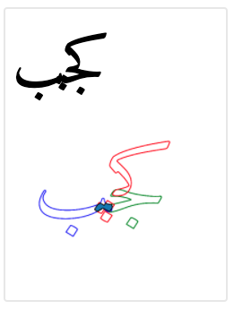

# collidoscope - brute force detection of glyph collisions

`collidoscope` reports on situations where paths overlap in a shaped
piece of text. For example, the sequence "ؼجب" might cause a collision like so:

This software tries every combination of glyphs within a specified Unicode range and up to a specified length of string and outputs a report of all situations where the glyphs collide. It has a number of collision tests:

* Paths in non-adjacent glyphs are never allowed to collide.
* If the *cursive* test is turned on, then paths with a cursive attachment anchor are allowed to overlap with paths in the next with a cursive attachment anchor, but are *not* allowed to overlap with a path *without* a cursive attachment anchor.
* If the *area* test is turned on, then paths in adjacent glyphs may collide so long as the area of overlap does not exceed a given percentage of the smallest path's area. i.e. if the area percentage is set to 25%, then two strokes may *connect*, because the overlap is likely to be quite small compared to the size of the paths involved. But if a stroke significantly overlaps a nukta, it will be reported as a collision. (Of course, this will not detect strokes which merely graze a nukta.)

Depending on the length of the string and the number of glyphs tested, this may take a *very* long time.

To use it:

    python3 collidoscope -r 0620-064A yourfont.otf > report.html

This creates a collision report on `report.html` for all sequences of three characters within the range 0x620 to 0x64A.

    python3 collidoscope -r 0620-064A,0679-06D3 -area 10 yourfont.otf > report.html

This creates a collision report on `report.html` for all sequences of three characters within the range 0x620 to 0x64A and also 0x679 to 0x6D3, and turns on the area test at a tolerance of 10% of the area of the smallest path involved in collision.

    python3 collidoscope -c 5 -cursive yourfont.otf > report.html

This tests for non-adjacent glyphs and collisions not involving cursive connection for *all combinations of glyphs in your font* with a five-character string. This may take a number of years to compute.

    python3 collidoscope -c 5 -cursive yourfont.otf > report.html

This just runs an area test for two-character sequences across the basic Arabic range.

## Requirements

This requires some Python modules to be installed. You can install them like so:

    pip3 install beziers>=0.0.3
    pip3 install uharfbuzz
    pip3 install fonttools
    pip3 install matplotlib
